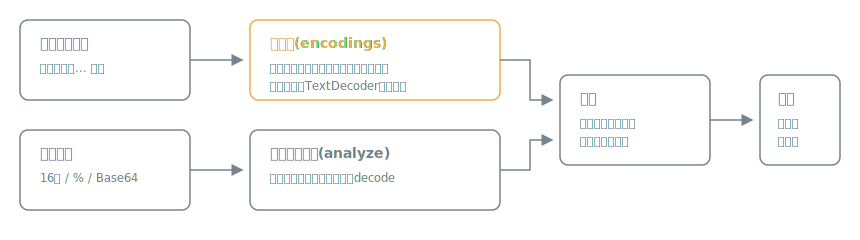

# mojibake

[](https://github.com/miruky/mojibake/actions/workflows/ci.yml)
[](https://www.typescriptlang.org/)
[](https://vitest.dev/)
[](https://opensource.org/licenses/MIT)

**「縺薙ｓ縺ｫ縺｡縺ｯ」のような化けた文字列から、どのエンコーディングの誤読が原因かを逆引きし、元の文字列を復元する解析器です。**

## 概要

文字化けは「エンコーディングAで書かれたバイト列を、エンコーディングBとして読んだ」ときに起きます。mojibakeは化けた文字列を貼ると、誤読の組み合わせを総当たりして「UTF-8で書かれたバイト列をShift_JISとして読んだ」のような原因の説明と復元した文字列を、日本語の文章らしさ順に提示します。バイト列(16進ダンプ・%エンコード・Base64)からの総当たり復号と、BOMの検出にも対応します。

動かす: https://miruky.github.io/mojibake/

### なぜ作ったのか

化けたメールの件名やログ、ダウンロードしたCSVを前に「これは元は何だったのか」を調べるには、エンコーディングの組み合わせを知識で推測して変換コマンドを試す必要がありました。組み合わせは機械的に総当たりできるので、貼るだけで原因と復元結果が出るツールにしました。原因の説明つきなので、復元するだけでなく、どこの設定を直せば再発しないかの手がかりになります。

## 使い方

### 化けた文字から逆引き

1. 画面に表示された化けた文字列をそのまま貼る
2. 「Shift_JIS(CP932) で書かれたバイト列を UTF-8 として読んだ」のような原因候補と復元文が、らしさ順に表示される

### バイト列から総当たり

1. 16進ダンプ(`82 b1 82 f1`)・%エンコード(`%E3%81%82`)・Base64のいずれかを貼る
2. 全候補エンコーディングでの復号結果が、らしさ順に表示される。先頭にBOMがあれば指摘する

### 対応エンコーディング

UTF-8、Shift_JIS(CP932)、EUC-JP、ISO-2022-JP、Windows-1252、UTF-16LE/BE。逆引き(再エンコード)はUTF-8・Shift_JIS・EUC-JP・Windows-1252で可能です。2回以上誤読を重ねた化け方や、復号時に情報が失われた化け方(置換文字「?」になった部分)は復元できません。

## アーキテクチャ



ブラウザの `TextEncoder` はUTF-8専用で、Shift_JISやEUC-JPへのエンコーダは存在しません。mojibakeは起動時に `TextDecoder` へ全バイト組み合わせを食わせて「文字からバイト列への逆引き表」を実行時構築することでこの制約を回避しています。日本語らしさの採点は、かな・漢字・和文記号の比率を加点し、復号失敗(U+FFFD)と制御文字を減点する単純なヒューリスティクスです。

## 技術スタック

| カテゴリ | 技術                                      |
| :------- | :---------------------------------------- |
| 言語     | TypeScript 5(strict)                      |
| 変換     | TextDecoder / TextEncoder(実行時依存なし) |
| ビルド   | Vite                                      |
| テスト   | Vitest(18テスト)                          |
| リンタ   | ESLint + Prettier                         |
| CI / CD  | GitHub Actions                            |
| 配信     | GitHub Pages                              |

## プロジェクト構成

- `src/lib/encodings.ts` — 候補エンコーディングの定義と、TextDecoder逆引きによるエンコーダ構築
- `src/lib/analyze.ts` — 日本語らしさの採点、総当たり復号、誤読組み合わせの逆引き
- `src/lib/bytes.ts` — 16進・%・Base64の解釈とBOM検出
- `src/app.ts` — 2モードの画面と候補表示
- `docs` — アーキテクチャ図
- `.github/workflows` — CIとGitHub Pagesデプロイ

## はじめ方

### 前提条件

- Node.js 20以上

### セットアップ

```bash
git clone https://github.com/miruky/mojibake.git
cd mojibake
npm install
npm run dev
```

### テストの実行

```bash
npm test
```

### Lintの実行

```bash
npm run lint
```

### デプロイ

`main` ブランチへのプッシュでGitHub Actionsがビルドし、GitHub Pagesへ自動デプロイします。

## 設計方針

- **原因まで説明する** — 復元結果だけでなく「何を何として誤読したか」を示し、設定の修正につなげる
- **エンコーダは実行時に逆引き構築** — 変換表をバンドルせず、ブラウザ標準のTextDecoderから組み立てる。依存ゼロでサイズも増えない
- **偽陽性を抑える** — 任意のバイト列が偶然漢字の羅列になるUTF-16は復元元候補から外し、復号失敗を含む候補は出さない
- **送信ゼロ** — 解析はすべてブラウザ内。貼られたデータをネットワークに流さない

## ライセンス

[MIT](LICENSE)
